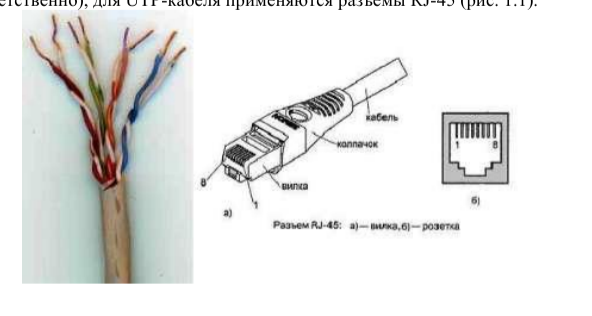
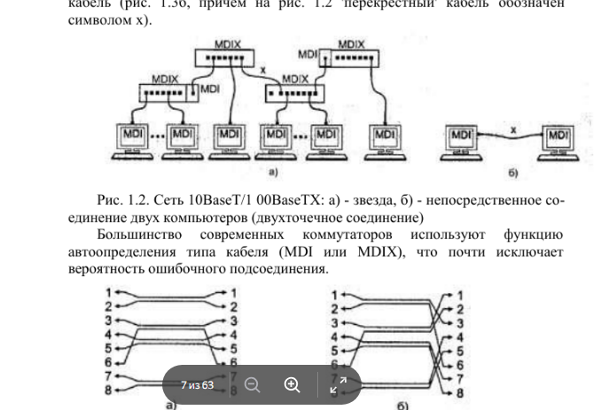
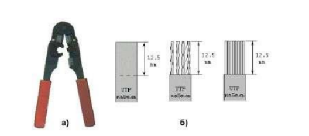
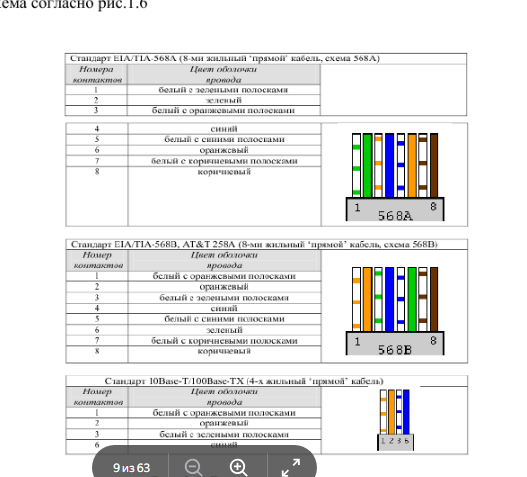
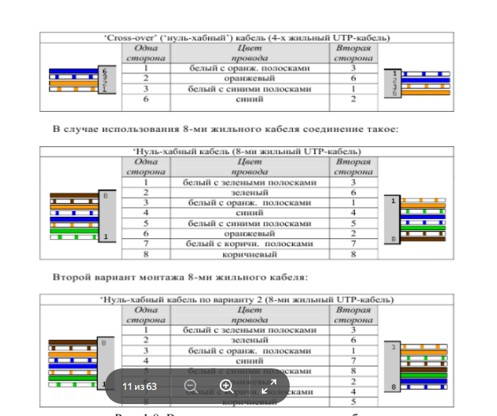

# ОТЧЁТ ПО ЛАБОРАТОРНОЙ РАБОТЕ № 1

**Тема:** «Подключение персонального компьютера к локальной вычислительной сети»

**Выполнил:** студент группы 28ИПО8481  
**ФИО:** Емельянов Павел Александрович

---

## 1. ЦЕЛЬ РАБОТЫ

Получить практические навыки подключения ПК к проводной локальной сети. В ходе работы необходимо:

- изучить назначение и основные параметры сетевых адаптеров;
- освоить разделку и обжим кабеля «витая пара» UTP Cat 5;
- разобраться в стандартах T568A и T568B;
- выполнить физическое подключение компьютера к сети Ethernet;
- проверить готовый патч-корд с помощью LAN-тестера.

---

## 2. МАТЕРИАЛЫ И ОБОРУДОВАНИЕ

| Оборудование | Краткая характеристика |
| :--- | :--- |
| Персональный компьютер | IBM PC-совместимый, ОС Windows |
| Сетевой адаптер | PCI-E, Realtek Gigabit Ethernet, разъём RJ-45 |
| Кабель | UTP Cat 5, 4 пары, 8 медных жил |
| Коннекторы | RJ-45 (8P8C), прозрачный корпус |
| Кримпер | Инструмент для обжима, обрезки и зачистки кабеля |
| LAN-тестер | Модель NS-468 для проверки целостности и распиновки |

---

## 3. КРАТКИЕ ТЕОРЕТИЧЕСКИЕ СВЕДЕНИЯ

### 3.1. Кабель UTP

UTP (Unshielded Twisted Pair) — неэкранированная витая пара. Проводники внутри кабеля скручены попарно с разным шагом. Это снижает влияние внешних помех и уменьшает перекрёстные наводки между парами. Категория Cat 5 рассчитана на частоты до 100 МГц и обеспечивает скорость до 100 Мбит/с при использовании двух пар или до 1 Гбит/с при использовании всех четырёх пар.

### 3.2. MAC-адрес

MAC-адрес — уникальный физический идентификатор сетевого устройства. Он имеет длину 48 бит. Первые 24 бита определяют производителя, последние 24 бита — индивидуальный номер адаптера. MAC-адрес используется коммутаторами на втором уровне модели OSI.





---

## 4. ХОД ВЫПОЛНЕНИЯ РАБОТЫ

### 4.1. Подготовка инструментов

Для работы использовались кримпер, коннекторы RJ-45 и кабель UTP Cat 5. Кримпер позволяет снять внешнюю оболочку, ровно обрезать жилы и обжать коннектор.

### 4.2. Монтаж патч-корда

Порядок действий был следующим:

1. **Снятие внешней оболочки.** С помощью кримпера удалил верхний слой изоляции на расстоянии около 12–13 мм от края кабеля.
2. **Расплетение пар.** Аккуратно разделил четыре витые пары и выровнял все восемь жил.
3. **Укладка жил по стандарту T568B.**
   - 1 — бело-оранжевый;
   - 2 — оранжевый;
   - 3 — бело-зелёный;
   - 4 — синий;
   - 5 — бело-синий;
   - 6 — зелёный;
   - 7 — бело-коричневый;
   - 8 — коричневый.
4. **Обрезка жил.** Выровнял концы и обрезал их так, чтобы длина выступающей части составляла примерно 10–11 мм.
5. **Установка коннектора.** Вставил жилы в RJ-45 до упора, чтобы медные концы были видны в передней части разъёма.
6. **Обжим.** Поместил коннектор в кримпер и обжал его. Ножи контактов прорезали изоляцию жил и обеспечили электрическое соединение, а фиксатор зажал внешнюю оболочку кабеля.

```text
      ВИЛКА RJ-45 (8P8C)                     КРИМПЕР (СХЕМА)
    ____________________                   /|________________
   |                    |                 | |                |
   |  _  _  _  _  _  _  |                 | |      ( Ножи )  |
   | | || || || || || | | <--- Контакты  | | [========]    |
   | |_||_||_||_||_||_| |                 | | ( Гнездо )    |
   |____________________|                 | |_______________|
             ||                            \|
      [ ВИТАЯ ПАРА ]
```







---

## 5. РЕЗУЛЬТАТЫ РАБОТЫ

### 5.1. Проверка LAN-тестером

Готовый кабель подключил к тестеру NS-468. Индикаторы 1–8 на основном и удалённом блоках загорались поочерёдно и синхронно. Это означает, что обжим выполнен правильно: обрывов, коротких замыканий и ошибок распиновки нет.

### 5.2. Параметры сетевого адаптера

С помощью команды `ipconfig /all` были получены следующие данные:

- **Адаптер:** Realtek PCIe GBE Family Controller;
- **MAC-адрес:** 18-C0-4D-36-41-1A (OUI 18-C0-4D принадлежит GIGA-BYTE Technology Co., Ltd.);
- **Тип шины:** PCI-E;
- **Скорость подключения:** 1 Гбит/с.

---

## 6. ОТВЕТЫ НА КОНТРОЛЬНЫЕ ВОПРОСЫ

### Вопрос 1. Какие кабели применяются в Ethernet? Что такое UTP, его плюсы и минусы?

В технологии Ethernet используются коаксиальный кабель, оптоволокно и витая пара. Наиболее распространена витая пара. UTP — это неэкранированная витая пара, состоящая из четырёх скрученных пар медных проводников.

**Достоинства UTP:** низкая стоимость, простота монтажа, гибкость, распространённость.

**Недостатки:** слабая защита от сильных электромагнитных помех, ограничение длины сегмента до 100 метров.

### Вопрос 2. Что такое MDI и MDIX? Когда нужен перекрестный кабель?

MDI — интерфейс оконечного оборудования, например компьютера. В нём контакты 1–2 используются для передачи, а 3–6 — для приёма.

MDIX — интерфейс коммутационного оборудования, например свитча или хаба. В нём приём и передача уже перекрещены внутри устройства.

Перекрестный кабель нужен для соединения одинаковых типов устройств: компьютер—компьютер или свитч—свитч.

### Вопрос 3. Почему при обжиме RJ-45 не снимают изоляцию с отдельных жил?

Потому что контакты внутри коннектора выполнены в виде острых ножей. При обжиме они прорезают изоляцию и плотно контактируют с медной жилой. Такая технология называется IDC — Insulation Displacement Connector.

### Вопрос 4. Что такое «нуль-модемный» кабель?

В сетях Ethernet так часто называют перекрестный кабель. Он позволяет соединить два компьютера напрямую без коммутатора. В классическом RS-232 нуль-модемный кабель — это отдельный тип кабеля для прямого соединения двух устройств.

### Вопрос 5. Как идентифицируются сетевые адаптеры? Зачем менять MAC-адрес?

Основной идентификатор адаптера — MAC-адрес. Он уникален для каждого устройства.

Смена MAC-адреса может потребоваться для:

- сокрытия реального производителя устройства;
- обхода привязки у провайдера по MAC-адресу;
- тестирования сети и создания виртуальных узлов.

### Вопрос 6. В чём заключается конфигурирование сетевой платы?

На аппаратном уровне настраиваются IRQ и адреса ввода-вывода. В современных системах это выполняется автоматически по технологии Plug-and-Play.

На логическом уровне настраиваются параметры TCP/IP: IP-адрес, маска подсети, основной шлюз и DNS-серверы.

---

## 7. ВЫВОД

В ходе лабораторной работы был освоен полный процесс подключения компьютера к локальной сети Ethernet. Я научился правильно разделывать кабель UTP, соблюдать стандарт T568B, работать с кримпером и проверять готовый патч-корд тестером. Также были получены навыки определения MAC-адреса и параметров сетевого адаптера через командную строку Windows. Работа закрепила теоретические знания о стандартах IEEE 802.3 и подготовила основу для дальнейшего изучения сетевых протоколов.