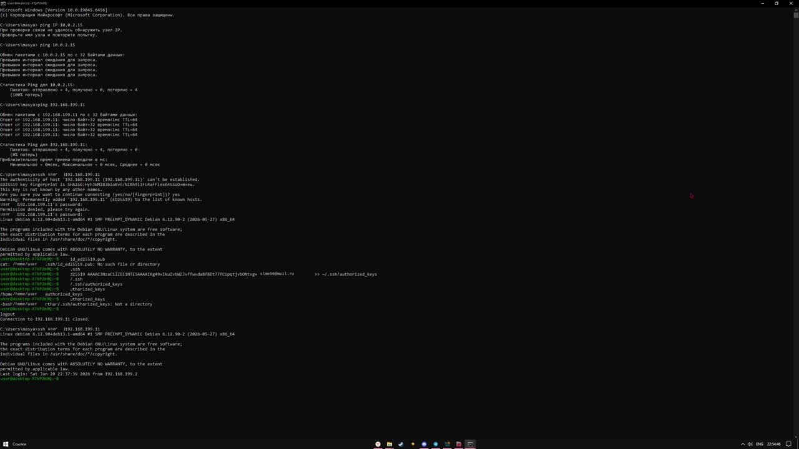
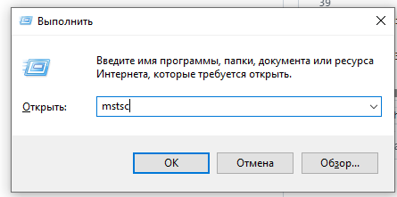

# Лабораторная работа: Подключение к Raspberry Pi (SSH, VNC, RDP, SCP)

**Выполнил:** студент группы 28ИПО8481  
**ФИО:** Емельянов Павел Александрович

## Данные для подключения

- **IP-адрес Raspberry Pi:** 192.168.129.150
- **Логин:** user
- **Пароль:** 123

---

## Этап 1. Подключение через SSH

Для подключения к Raspberry Pi по протоколу SSH откроем терминал (PowerShell или командную строку) на ПК и выполним команду:

```
ssh user@192.168.129.150
```

Далее потребуется ввести пароль (123), после чего мы получим доступ к консоли Raspberry Pi.



### Создание персональной папки

В корневом каталоге находится папка с номером группы. Создадим в ней каталог с фамилией студента:

```
mkdir Emelyanov
```

Выполним задание по созданию каталогов и файлов, затем сделаем скриншот с выполненной командой:

```
ls -R
```

Для отключения от SSH используем команду:

```
exit
```

---

## Этап 2. Создание и использование SSH-ключей

При использовании ключа отпадает необходимость вводить пароль при каждом новом подключении к плате по SSH. Рассмотрим процесс создания SSH-ключей.

### Проверка существующих ключей

```
ls ~/.ssh
```

Если в результате выполнения команды будут обнаружены файлы `id_rsa.pub` или `id_dsa.pub`, значит ключи уже присутствуют в системе, и шаг генерации можно пропустить.

### Генерация SSH-ключей

Для создания ключей используем команду:

```
ssh-keygen
```

После вызова команды нужно указать путь для сохранения файлов ключей. Обычно путь по умолчанию (`~/.ssh/`) вполне подходит, поэтому просто нажимаем Enter.

Далее будет предложено ввести пароль для дополнительной защиты приватного ключа. Можно задать пароль или просто нажать Enter, оставив поле пустым.

Проверим папку `.ssh`:

```
ls ~/.ssh
```

В результате обнаружим файлы:
- `id_rsa.pub` — публичный (открытый) ключ;
- `id_rsa` — приватный (закрытый) ключ.

Приватный ключ хранится на ПК, а публичный — на устройстве, к которому необходимо подключиться (в данном случае на Raspberry Pi).

### Копирование ключа на Raspberry Pi

Чтобы использовать сгенерированные ключи для подключения по SSH, необходимо добавить публичный ключ в файл `~/.ssh/authorized_keys` на Raspberry. Можно скопировать файл вручную либо использовать команду:

```
ssh-copy-id user@192.168.129.150
```

Теперь мы сможем подключаться к Raspberry Pi без использования пароля:

```
ssh user@192.168.129.150
```


---

## Этап 3. Подключение через TigerVNC

1. **Запуск:** Откроем TigerVNC на ПК.
2. **Ввод IP:** В поле VNC-сервер введём `192.168.129.150`.
3. **Настройка курсора:** Нажмём «Параметры» → вкладка «Ввод» → поставим галочку «Показывать точку при отсутствии курсора».
4. **Соединение:** Нажмём «Подключиться». Если появится предупреждение безопасности, нажмём «Да».
5. **Авторизация:** В окне аутентификации введём логин `user` и пароль `123`.
6. **Фиксация:** Сделаем скриншот всего экрана ПК (включая рабочий стол Raspberry Pi и системный трей Windows с часами). Сохраним как `vnc_screen.png`.

---

## Этап 4. Подключение через RDP (Удалённый рабочий стол)

1. **Запуск:** Нажмём Win + R, введём `mstsc` и нажмём Enter.
2. **Ввод IP:** В поле «Компьютер» введём `192.168.129.150` и нажмём «Подключить».
3. **Авторизация:** Введём логин `user` и пароль `123`.
4. **Фиксация:** Сделаем скриншот экрана (вместе с системным треем). Сохраним как `rdp_screen.png`.



---

## Этап 5. Работа по SSH и копирование файлов (SCP)

### Шаг 5.1. Создание персональной папки на Raspberry Pi

Перед отправкой файлов необходимо создать целевую директорию через консоль, так как утилита `scp` не умеет создавать папки автоматически.

1. Откроем терминал (PowerShell или командную строку) на своём ПК.
2. Подключимся к плате по SSH:

```
ssh user@192.168.129.150
```

3. Введём пароль `123`.
4. Создадим папку со своей фамилией:

```
mkdir Emelyanov
```

5. Закроем сессию SSH командой `exit`.

### Шаг 5.2. Загрузка скриншотов на Raspberry Pi (Upload)

Перейдём в терминале ПК в папку, где лежат скриншоты, и отправим их на сервер в созданную папку:

```
scp vnc_screen.png rdp_screen.png user@192.168.129.150:~/Emelyanov/
```

## Вывод

В ходе лабораторной работы были освоены основные способы удалённого подключения к Raspberry Pi: SSH, VNC и RDP. Изучен механизм создания и использования SSH-ключей для беспарольного подключения. Получены практические навыки работы с утилитой `scp` для передачи файлов между локальным ПК и удалённой платой. Все поставленные задачи выполнены в полном объёме.