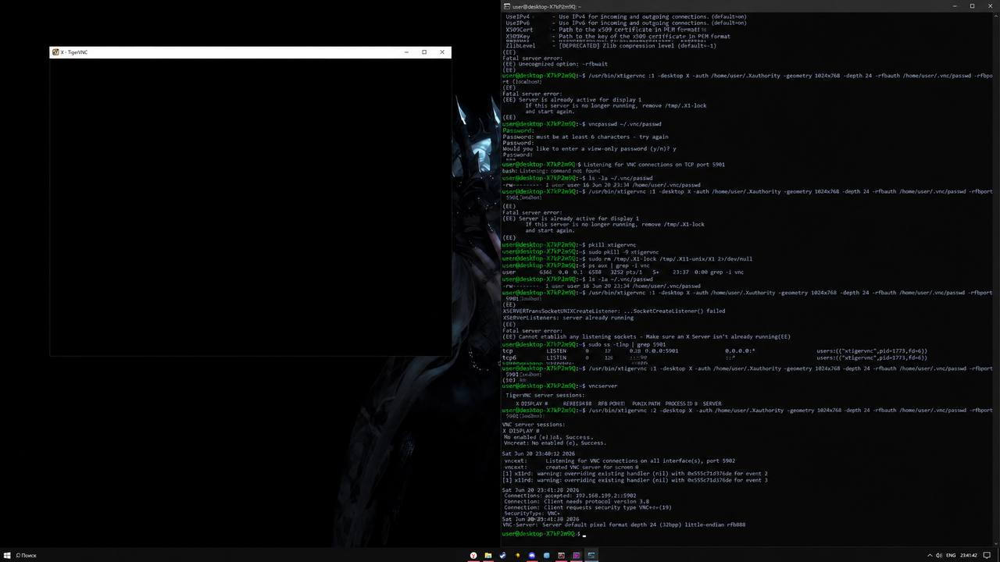

# Лабораторная работа: Подключение к Raspberry Pi (VNC, RDP, SSH, SCP)

**Выполнил:** студент группы 28ИПО8481  
**ФИО:** Емельянов Павел Александрович

## Данные для подключения

- **IP-адрес Raspberry Pi:** 192.168.129.150
- **Логин:** user
- **Пароль:** 123

---

## Этап 1. Подключение через TigerVNC

1. **Запуск:** Откроем TigerVNC на ПК.
2. **Ввод IP:** В поле «VNC-сервер» введём `192.168.129.150`.
3. **Настройка курсора:** Нажмём «Параметры» → вкладка «Ввод» → поставим галочку «Показывать точку при отсутствии курсора».
4. **Соединение:** Нажмём «Подключиться». Если появится предупреждение безопасности, нажмём «Да».
5. **Авторизация:** В окне аутентификации введём логин `user` и пароль `123`.
6. **Фиксация:** Сделаем скриншот всего экрана ПК (включая рабочий стол Raspberry Pi и системный трей Windows с часами). Сохраним как `vnc_screen.png`.



---

## Этап 2. Подключение через RDP (Удалённый рабочий стол)

1. **Запуск:** Нажмём Win + R, введём `mstsc` и нажмём Enter.
2. **Ввод IP:** В поле «Компьютер» введём `192.168.129.150` и нажмём «Подключить».
3. **Авторизация:** Введём логин `user` и пароль `123`.
4. **Фиксация:** Сделаем скриншот экрана (вместе с системным треем). Сохраним как `rdp_screen.png`.


---

## Этап 3. Работа по SSH и копирование файлов (SCP)

### Шаг 3.1. Создание персональной папки на Raspberry Pi

Перед отправкой файлов необходимо создать целевую директорию через консоль, так как утилита `scp` не умеет создавать папки автоматически.

1. Откроем терминал (PowerShell или командную строку) на своём ПК.
2. Подключимся к плате по SSH:

```
ssh user@192.168.129.150
```

3. Введём пароль `123`.
4. Создадим папку со своей фамилией:

```
mkdir Emelyanov
```

5. Закроем сессию SSH командой `exit`.

### Шаг 3.2. Загрузка скриншотов на Raspberry Pi (Upload)

Перейдём в терминале ПК в папку, где лежат скриншоты, и отправим их на сервер в созданную папку:

```
scp vnc_screen.png rdp_screen.png user@192.168.129.150:~/Emelyanov/
```

## Вывод

В ходе лабораторной работы были освоены основные способы удалённого подключения к Raspberry Pi: VNC и RDP. Получены практические навыки работы с утилитой `scp` для передачи файлов между локальным ПК и удалённой платой. Все поставленные задачи выполнены в полном объёме.