# Практическая работа №11б — Команды меню «Выполнить»

**Цель работы:** научиться быстро запускать системные утилиты Windows через меню «Выполнить» (Win+R) и понимать, какую информацию о своём компьютере они показывают.

**Комплектация ПК для примеров:**
- Процессор: AMD Ryzen 5 3600
- Видеокарта: NVIDIA RTX 2060 Super
- ОЗУ: 16 ГБ DDR4-2133 МГц
- Накопители: SSD 128 ГБ + HDD 1 ТБ

---

## Задание: потренируйтесь в вводе команд

Запустите меню «Выполнить» (Win+R), введите каждую из перечисленных команд и посмотрите, какая информация откроется. Сравните с примерами ниже.

---

### 1. `control`
Открывает **Панель управления** Windows.  
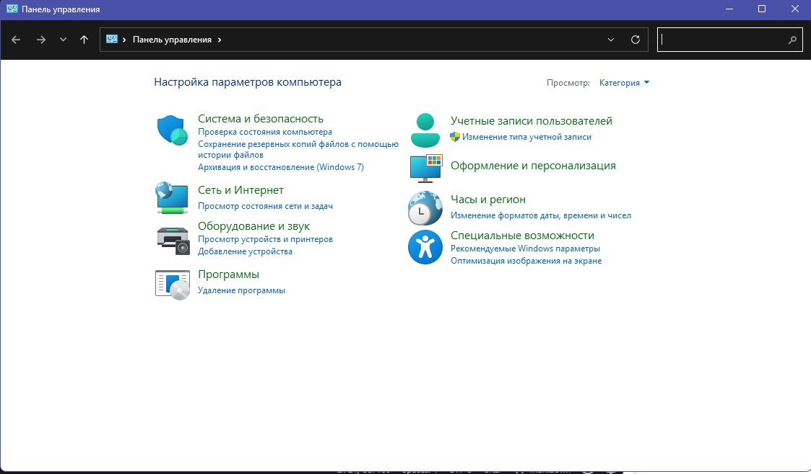
### 2. `.` (точка)
Открывает папку **текущего пользователя** (C:\Users\Ваше_имя).  
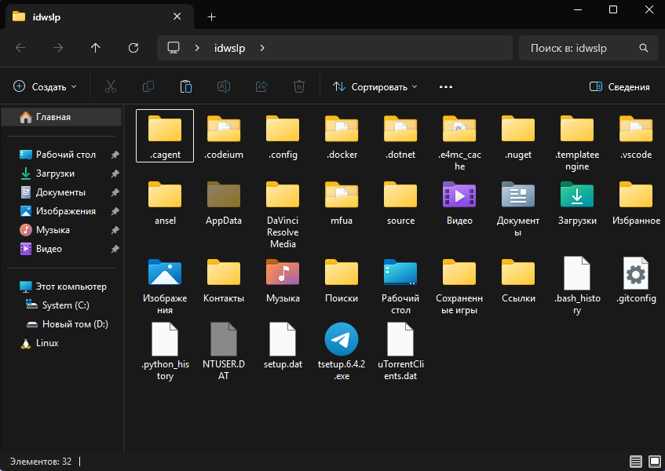
### 3. `..` (две точки)
Открывает папку **«Пользователи»** (C:\Users), где хранятся документы всех учётных записей этого компьютера.
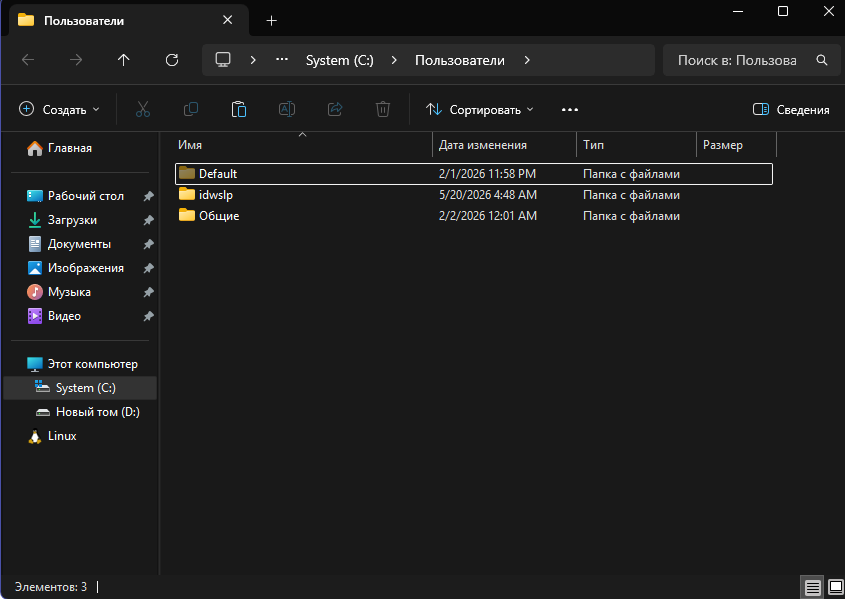
### 4. `appwiz.cpl`
Открывает меню **«Программы и компоненты»** — список установленных приложений.  
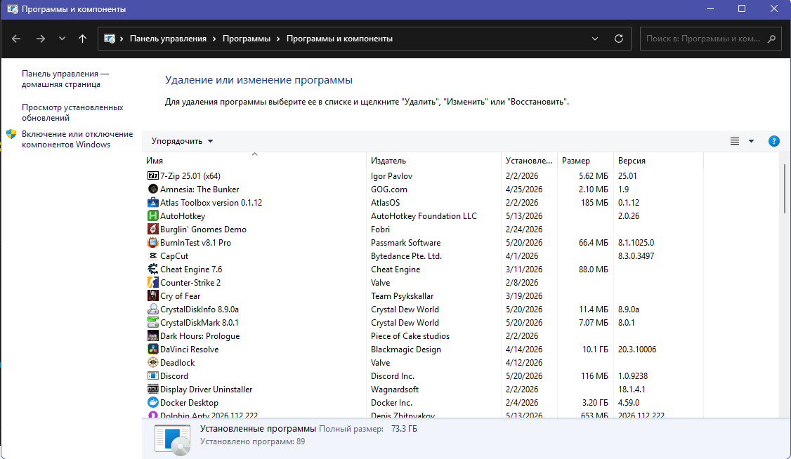
### 5. `msconfig`
Открывает **«Конфигурацию системы»**.  
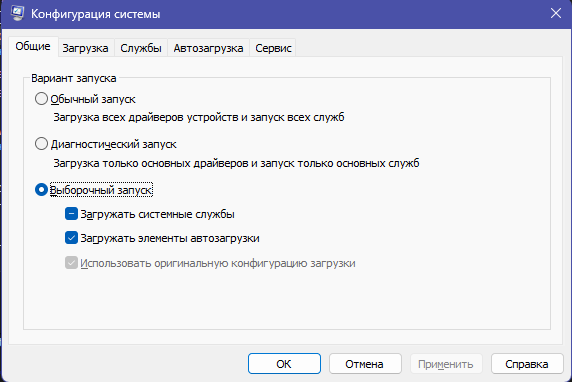
### 6. `devmgmt.msc` или `hdwwiz.cpl`
Запускает **«Диспетчер устройств»**.  
- Процессоры → AMD Ryzen 5 3600 (6 ядер, 12 логических)
- Видеоадаптеры → NVIDIA GeForce RTX 2060 Super
- Дисковые устройства → SSD 128 ГБ и HDD 1 ТБ
- Оперативная память → 16 ГБ (отобразится в разделе «Системные устройства»)
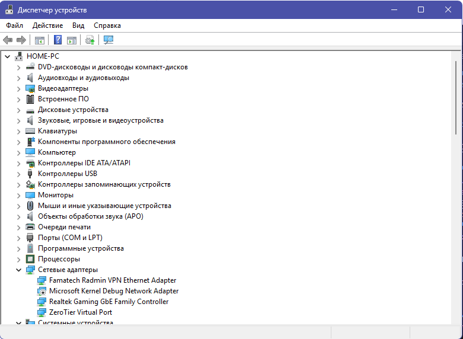
### 7. `powercfg.cpl`
Открывает настройки **электропитания**.  
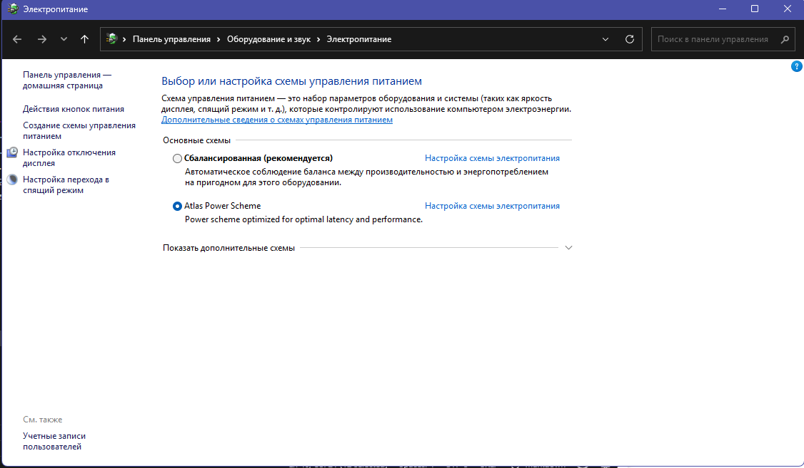
### 8. `diskmgmt.msc`
Запускает **«Управление дисками»**.  
- Диск 0: SSD 128 ГБ (обычно диск C:)
- Диск 1: HDD 1 ТБ (диск D: или E:)
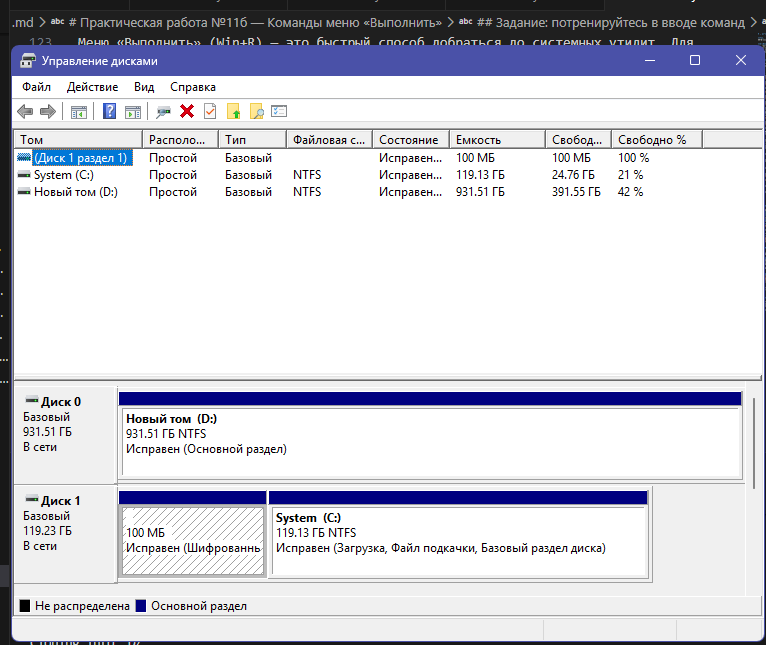
### 9. `msinfo32`
Открывает **«Сведения о системе»**.  
- Процессор: AMD Ryzen 5 3600, 3600 МГц, 6 ядер
- Установленная память (ОЗУ): 16,0 ГБ
- Тип системы: x64
- Имя видеокарты: NVIDIA GeForce RTX 2060 Super
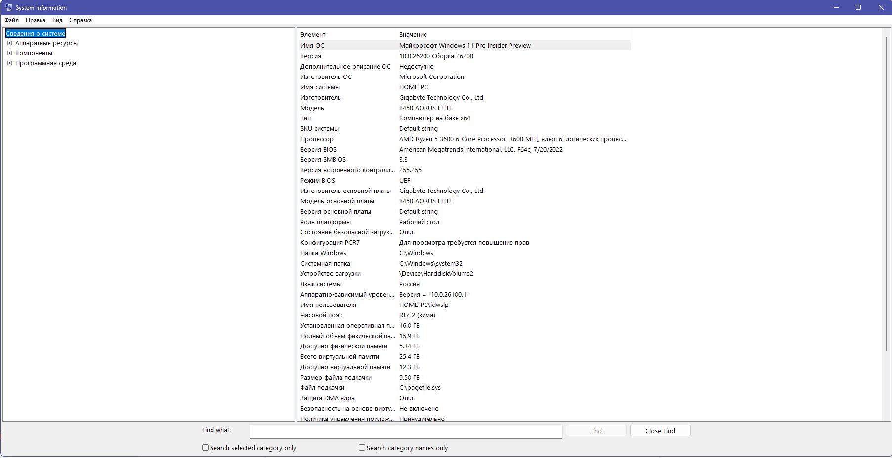
### 10. `netplwiz`
Открывает окно **«Учётные записи пользователей»**.  
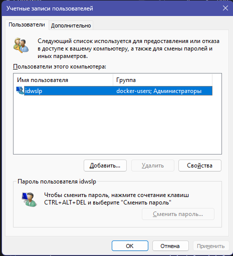
### 11. `osk`
Запускает **экранную клавиатуру** — полезна, если физическая клавиатура временно не работает.
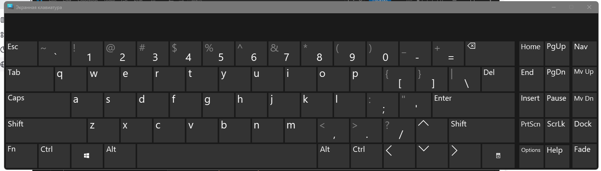
### 12. `services.msc`
Открывает список **системных служб**.  
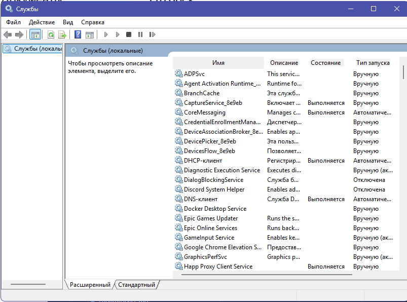
### 13. `cmd`
Запускает **командную строку**.  
- `systeminfo` — подробная информация о системе
- `wmic diskdrive get model,size` — модель и объём дисков
- `dxdiag` — запуск средства диагностики DirectX (можно и отсюда)
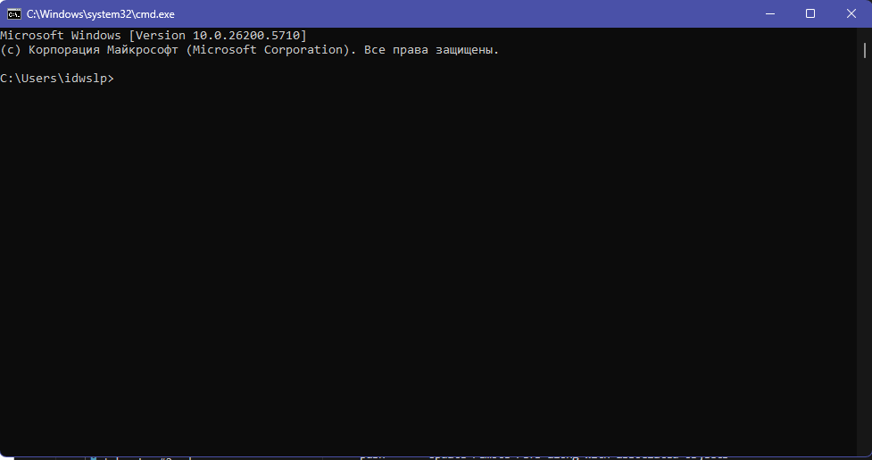
### 14. `control folders`
Открывает **«Параметры Проводника»** (раньше «Свойства папок»).  
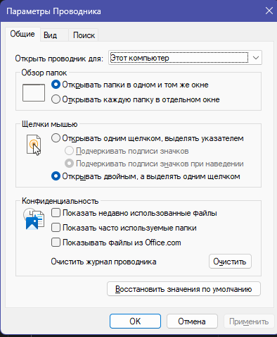
### 15. `ncpa.cpl`
Открывает **«Сетевые подключения»**.  
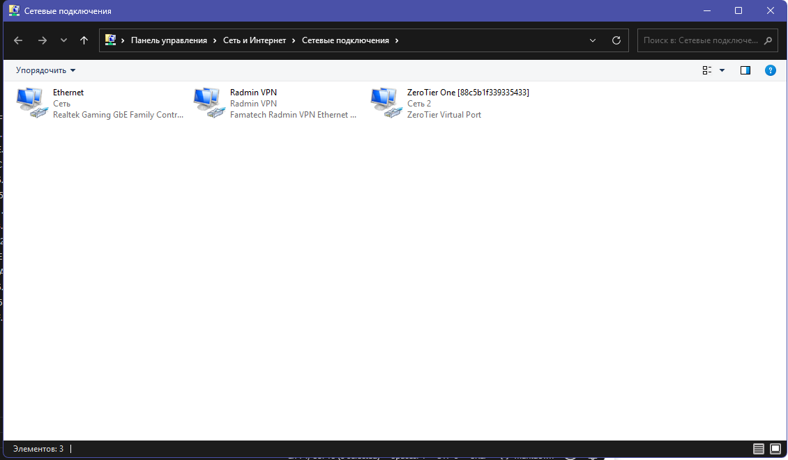

---

### 1. Какие альтернативные способы запуска перечисленных утилит вы знаете?

Почти каждую утилиту можно запустить через:
- **Пуск → Поиск** (ввести название, например, «Диспетчер устройств»).
- **Панель управления** (соответствующий раздел).
- **Правый клик по кнопке Пуск** (откроется быстрая ссылка на Диспетчер устройств, Управление дисками, Службы).
- **Командная строка или PowerShell** (те же команды, но можно добавить запуск от администратора).
- **Создать ярлык** на рабочем столе с путём к утилите (например, `C:\Windows\System32\devmgmt.msc`).

Конкретные примеры:

| Утилита | Альтернативный запуск (на вашем ПК) |
|--------|--------------------------------------|
| `devmgmt.msc` | Пуск → правый клик → Диспетчер устройств |
| `diskmgmt.msc` | Пуск → правый клик → Управление дисками |
| `msinfo32` | Пуск → поиск «Сведения о системе» |
| `cmd` | Пуск → поиск «cmd» → правый клик → Запуск от имени администратора |

### 2. Возможен ли запуск утилит через меню «Выполнить» от имени администратора?

**Нет**, напрямую через Win+R нельзя — все команды запускаются с правами текущего пользователя.

**Как запустить от имени администратора:**
- Способ 1: Открыть **командную строку от имени администратора** (Пуск → `cmd` → правый клик → «Запуск от имени администратора»), а затем ввести нужную команду.
- Способ 2: Через **Диспетчер задач** (`Ctrl+Shift+Esc`) → «Файл» → «Запустить новую задачу» → ввести команду → поставить галочку «Создать задачу с правами администратора».
- Способ 3: Создать **ярлык** утилиты, в его свойствах нажать «Дополнительно» → «Запуск от имени администратора».

**Для вашего ПК** команды, которые **требуют** прав администратора:
- `msconfig` (при изменении параметров загрузки)
- `devmgmt.msc` (при обновлении драйверов видеокарты или другого железа)
- `diskmgmt.msc` (при изменении размера разделов диска)
- `services.msc` (при остановке/запуске системных служб)
- `cmd` (для команд типа `chkdsk` или `diskpart`)

Без прав администратора вы сможете только просматривать информацию, но не изменять критические настройки.

---

## Вывод

Меню «Выполнить» (Win+R) — это быстрый способ добраться до системных утилит. Для вашего компьютера с Ryzen 5 3600 и RTX 2060 Super наиболее полезными будут `msinfo32` (проверить частоту ОЗУ и модель процессора), `devmgmt.msc` (проверить драйвер видеокарты), `diskmgmt.msc` (посмотреть SSD и HDD). Помните, что для изменения настроек нужно запускать утилиту от имени администратора через другие методы.