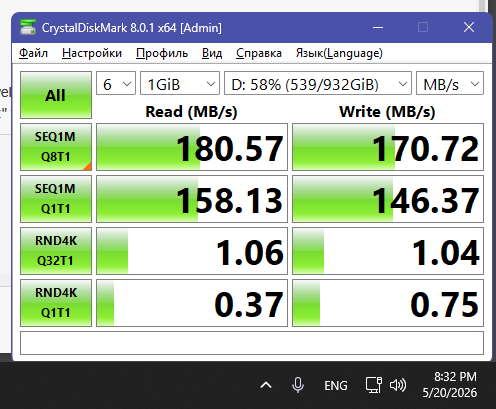

| Вид теста  | Чтение (MB/s)  | Запись (MB/s) |
|------------|----------------|---------------|
| SFQ1MQ8T1  | 180.57         | 170.72        |
| SEQ1MQ1T1  | 158.13         | 146.37        |
| RND4KQ32T1 | 1.06           | 1.04          |
| RND4KQ1T1  | 0.37           | 0.75          |

**Скрин выполнения лабараторной**

# Контрольные вопросы (кратко)

## 1. Что такое жесткий диск?
Устройство для долговременного хранения данных. Запись на вращающиеся магнитные пластины подвижными головками.

## 2. Внутреннее устройство и ААС
**Внутри:** пластины, шпиндель (двигатель), головки чтения/записи на каретке (актуаторе), контроллер.  
**ААС (Automatic Acoustic Management)** – технология снижения шума за счёт замедления движения головок (цена – падение скорости доступа).

## 3. Причины проблем с совместимостью
- Разные интерфейсы (IDE, SATA, NVMe)
- Старый BIOS (не видит диски >2 ТБ, нет режима AHCI)
- Неподдерживаемая файловая система
- Устаревшие драйверы / прошивка
- Нехватка питания при запуске диска

## 4. Методы уменьшения проблем
- Проверять совместимость перед покупкой
- Обновить BIOS/UEFI
- Выбрать в BIOS нужный режим: AHCI (новые ОС) или IDE (старые)
- Использовать GPT для дисков >2 ТБ
- Обновить драйверы и прошивку диска
- Применить переходники или внешний контроллер (PCIe)