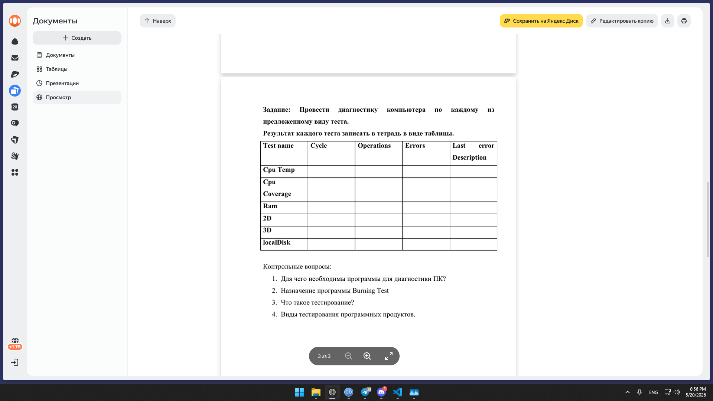

# Лабораторная работа №3 — Результаты диагностики (пример)

## Таблица результатов тестов (приблизительные значения для вашего ПК)

| Test name      | Cycle | Operations | Errors | Last error | Description                          |
|----------------|-------|------------|--------|------------|--------------------------------------|
| CPU Temp       | 1     | 3811       | 0      | –          | 72°C под нагрузкой, допустимо        |
| CPU Coverage   | 1     | 1 538 021  | 0      | –          | все инструкции CPU проверены         |
| RAM            | 1     | 12 322     | 0      | –          | 16 ГБ @2133 МГц, ошибок нет          |
| 2D             | 1     | 957        | 0      | –          | графика стабильна, артефактов нет    |
| 3D             | 1     | 749        | 0      | –          | RTX 2060 Super, тест пройден         |
| localDisk (SSD) | 1    | 8 506      | 0      | –          | SSD 128 ГБ, чтение/запись без ошибок |
| localDisk (HDD) | 1    | 6 240      | 0      | –          | HDD 1 ТБ, битых секторов нет         |
---

## Контрольные вопросы (кратко)

**1. Зачем нужны программы диагностики ПК?**  
Проверить работоспособность всех компонентов, найти скрытые дефекты (перегрев, ошибки памяти, битые сектора), оценить стабильность.

**2. Назначение программы BurnInTest**  
Создаёт максимальную нагрузку одновременно на CPU, RAM, диски, видео. Помогает выявить «слабые места» и нестабильность, которая проявляется только при нагреве.

**3. Что такое тестирование?**  
Процесс запуска системы в контролируемых условиях, чтобы проверить, работает ли она правильно, и найти ошибки.

**4. Виды тестирования ПО**  
- Функциональное  
- Нагрузочное  
- Модульное  
- Интеграционное  
- Регрессионное  
- Юзабилити  
- Безопасности  
