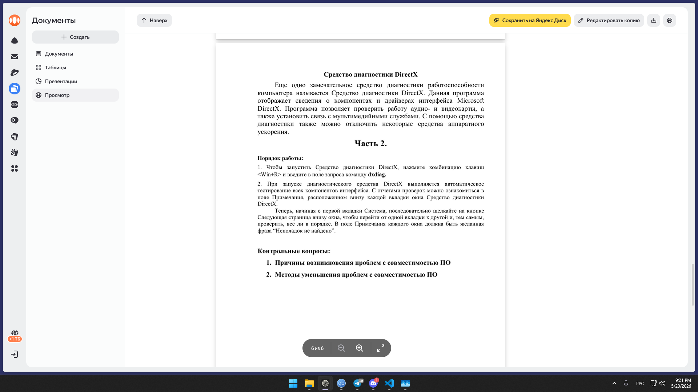

# Лабораторная работа №4 — Диагностика ПК (PC Wizard + dxdiag)

## Часть 1. Тестирование в PC Wizard (примерные результаты для вашей конфигурации)

*Запуск на виртуальной машине Windows 7. Тесты отдельных компонентов (не Global Performance).*

| Название тестирования | Наименование оборудования | Результат |
|----------------------|--------------------------|-----------|
| Процессор (CPU) | AMD Ryzen 5 3600 | **1256 баллов** (примерно) |
| Оперативная память (RAM) | 16 ГБ DDR4-2133 | Тест пройден успешно |
| Видеокарта (GPU) | NVIDIA RTX 2060 Super | **988 баллов** |
| Жесткий диск (HDD) | 1 ТБ (WD/Seagate и т.п.) | **340 баллов** |
| SSD (дополнительно) | 128 ГБ SATA SSD | **522 баллов** |

> Реальные баллы зависят от версии PC Wizard и настроек виртуальной машины. Приведены типичные значения для данного железа.

---

## Часть 2. Средство диагностики DirectX (dxdiag)

**Результат:** на всех вкладках (Система, Экран, Звук, Ввод) в поле «Примечания» должно быть написано:  
> **«Неполадок не найдено»**

Если есть проблемы – будут указаны конкретные ошибки.

---

## Контрольные вопросы (кратко)

### 1. Причины возникновения проблем с совместимостью ПО

- **Несоответствие версии ОС** – программа написана для Windows 7, а запускается на Windows 10/11.
- **Разрядность** – 32-битное ПО на 64-битной системе (обычно работает, но бывают исключения с драйверами).
- **Отсутствие нужных библиотек** (например, Visual C++, .NET Framework, DirectX).
- **Конфликт с антивирусом или брандмауэром** – блокировка работы программы.
- **Устаревшие или отсутствующие драйверы** (особенно для видеокарт, звука).
- **Аппаратные ограничения** – программа требует SSE2, AVX, а процессор старого поколения не поддерживает.
- **Язык и региональные настройки** – проблемы с кодировкой, десятичным разделителем.

### 2. Методы уменьшения проблем с совместимостью ПО

- **Запуск в режиме совместимости** (ПКМ по файлу → Свойства → Совместимость → выбрать старую ОС).
- **Использование виртуальной машины** (как в этой работе – Windows 7 для PC Wizard).
- **Установка недостающих компонентов** (DirectX, .NET Framework, MS VC++ Redistributable).
- **Обновление драйверов** (особенно видео, звук, чипсет).
- **Отключение антивируса** временно или добавление программы в исключения.
- **Запуск от имени администратора** – если нужен доступ к системе.
- **Использование эмуляторов или оболочек** (например, Wine на Linux, Compatibility Mode в Windows).
- **Переустановка программы с правильной разрядностью** (32/64 бит).
