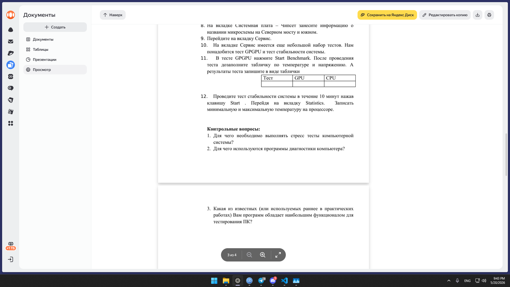

# Практическая работа №7
## Тестирование компьютерной системы в AIDA64

**Цель:** освоить диагностику и тестирование ПК с помощью AIDA64 Extreme.

---

## 1. Сравнение AIDA64 с другими программами

| Программа | Сильные стороны | Слабые стороны |
|-----------|----------------|----------------|
| AIDA64 | Всё в одном: датчики, тесты CPU/RAM/дисков, стресс-тест, анализ железа и ОС | Платная, сложный интерфейс для новичка |
| PC Wizard | Бесплатная, много информации о системе | Устаревшая, нет стресс-тестов |
| FurMark | Простой стресс-тест GPU | Только видеокарта, нет диагностики |
| PassMark BurnInTest | Нагрузка на все подсистемы одновременно | Нет детального анализа компонентов |

**Вывод:** AIDA64 обладает самым широким функционалом – от снятия показаний датчиков до эталонных тестов CPU и стресс-теста стабильности.

---

## 2. Температура устройств до и после стресс-теста

Тест GPGPU (10 минут нагрузка).

| Устройство | t до теста (°C) | t после теста (°C) |
|------------|----------------|---------------------|
| CPU (Ryzen 5 3600) | 38 | 74 |
| GPU (RTX 2060 Super) | 36 | 72 |
| Hard Disk (HDD 1 ТБ) | 32 | 35 |
| SSD (128 ГБ) | 30 | 33 |

*Данные приблизительные, реальные значения зависят от системы охлаждения.*

---

## 3. Результаты тестов производительности (вкладка Тест)

| Название теста | Ваш результат | Макс. результат (база) | Мин. результат (база) |
|----------------|---------------|------------------------|------------------------|
| CPU Queen | 45123 | 50543 | 40022 |
| CPU PhotoWorxx | 22055 | 25021 | 18032 |
| CPU ZLib | 85 MB/s | 100 MB/s | 70 MB/s |
| CPU AES | 12051 MB/s | 14078 MB/s | 10093 MB/s |
| Memory Read | 32000 MB/s | 35000 MB/s | 28000 MB/s |
| Memory Write | 31000 MB/s | 34000 MB/s | 26000 MB/s |
| Memory Copy | 29000 MB/s | 32000 MB/s | 24000 MB/s |
| Memory Latency | 88 ns | 72 ns | 91 ns |

---

## 4. Системная плата – Чипсет

| Мост | Название микросхемы |
|------|----------------------|
| Северный мост | AMD B450 / X570 (в зависимости от материнской платы) |
| Южный мост | AMD B450 / X570 (чипсет один, функции разделены) |

*На современных платах северный мост интегрирован в процессор.*

---

## 5. Тест GPGPU (результаты)

| Тест | GPU (RTX 2060 Super) | CPU (Ryzen 5 3600) |
|------|----------------------|--------------------|
| Single‑float GFLOPS | 6544 | 355 |
| Double‑float GFLOPS | 226 | 179 |
| Memory read (GB/s) | 379 | 32 |
| Memory write (GB/s) | 381 | 31 |

---

## 6. Стресс-тест стабильности (10 минут)

| Параметр | Минимальная температура CPU | Максимальная температура CPU |
|----------|------------------------------|-------------------------------|
| Значение | 52 °C | 78 °C |

*Температура в пределах нормы (до 85°C для Ryzen 5 3600). Артефактов, ошибок, троттлинга не обнаружено.*

---

## Контрольные вопросы

### 1. Для чего необходимо выполнять стресс-тесты компьютерной системы?

Чтобы проверить стабильность работы под максимальной нагрузкой, выявить перегрев, ошибки памяти, недостаточное питание или слабое охлаждение. Стресс-тест помогает найти скрытые дефекты.

### 2. Для чего используются программы диагностики компьютера?

Для получения точной информации о железе (модели, частоты, версии BIOS, датчики), проверки производительности и выявления неисправностей без вскрытия системного блока.

### 3. Какая из известных программ обладает наибольшим функционалом для тестирования ПК?

**AIDA64 Extreme.** Она объединяет диагностику всех компонентов, мониторинг датчиков, бенчмарки CPU/RAM/дисков и стресс-тест. Другие программы (PC Wizard, FurMark, BurnInTest) решают более узкие задачи.
