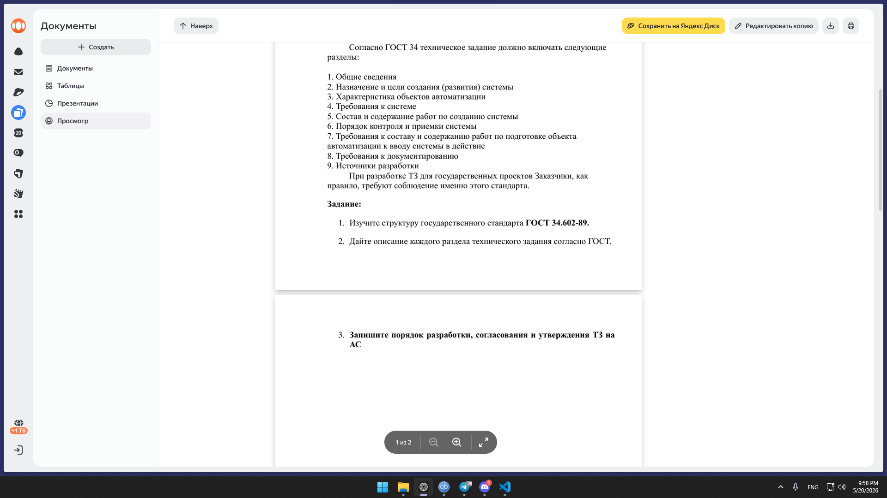

# Практическая работа №9
## ГОСТ 34.602-89. Техническое задание на создание автоматизированной системы

**Цель работы:** изучить структуру и порядок разработки ТЗ согласно ГОСТ 34.602-89.

---

## 1. Структура и описание разделов ТЗ

ГОСТ 34.602-89 устанавливает следующие разделы технического задания:

| № | Наименование раздела | Краткое содержание |
|---|----------------------|---------------------|
| 1 | Общие сведения | Полное и условное наименование системы; наименования заказчика и разработчика; плановые сроки начала и окончания работ; порядок оформления и предъявления результатов. |
| 2 | Назначение и цели создания системы | Вид автоматизируемой деятельности (управление, проектирование и т.п.); цели и критерии эффективности, которые должны быть достигнуты. |
| 3 | Характеристика объекта автоматизации | Описание объекта, его структуры, процессов; сведения о существующей системе управления. |
| 4 | Требования к системе | Требования к структуре, функциям, надёжности, безопасности, эргономике; к техническому, информационному, программному, организационному обеспечению. |
| 5 | Состав и содержание работ по созданию системы | Перечень этапов, сроки их выполнения, состав документации на каждом этапе. |
| 6 | Порядок контроля и приемки системы | Виды испытаний, порядок работы приёмочной комиссии, перечень документов для сдачи. |
| 7 | Требования к подготовке объекта к вводу системы | Мероприятия, выполняемые на объекте заказчика: обучение персонала, подготовка помещений, установка ПО. |
| 8 | Требования к документированию | Состав эксплуатационной документации и требования к её оформлению. |
| 9 | Источники разработки | Перечень документов, материалов, патентов, готовых модулей, на основе которых создаётся ТЗ. |

---

## 2. Порядок разработки, согласования и утверждения ТЗ на АС

1. **Разработка** – выполняется разработчиком системы на основе исходных требований заказчика.
2. **Согласование** – проект ТЗ направляется на согласование разработчику (подтверждение реальности выполнения) и другим заинтересованным организациям.
3. **Утверждение** – ТЗ утверждается заказчиком. Подпись заказчика ставится на титульном листе.
4. **Подписание разработчиком** – разработник ставит подпись в знак принятия обязательств по выполнению работ.

При необходимости ТЗ также согласовывается с лицензиаром или другими организациями, права которых затрагиваются.

---
